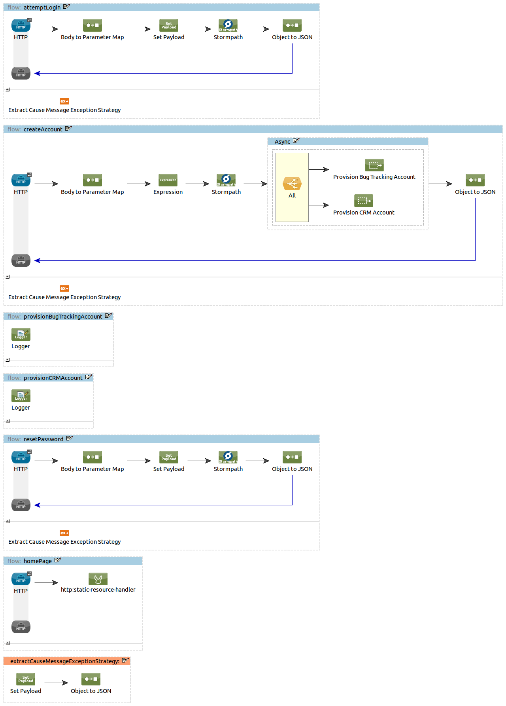

## Stormpath Connector Demo

### Execution instructions

- Edit `src/main/app/mule-app.properties` and uncomment and fill the Stormpath properties with values obtained from the Stormpath console
- Start the Mule application

The demo is ready: browsing to http://localhost:8081/demo/ should display it.

### Overview

