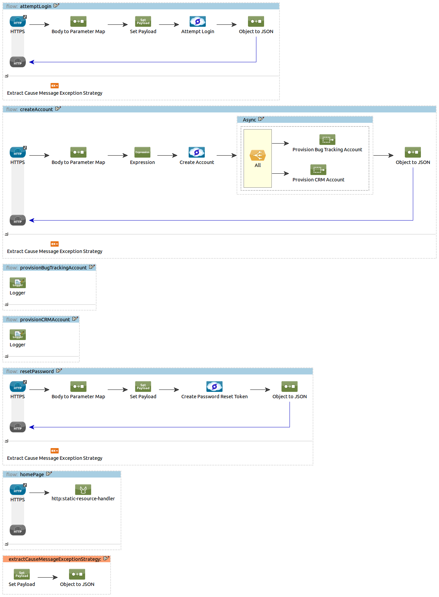

## Stormpath Connector Demo

### Execution instructions

- Edit `src/main/app/mule-app.properties` and uncomment and fill the Stormpath properties with values obtained from the Stormpath console
- Start the Mule application

The demo is ready: browsing to https://localhost:8443/demo/ should display it.

Note that you'll need to accept the self-signed certificate we use for the demo.
If you would deploy the application on CloudHub, you would instead benefit from the valid SSL certificate CloudHub provides. 

### Overview

